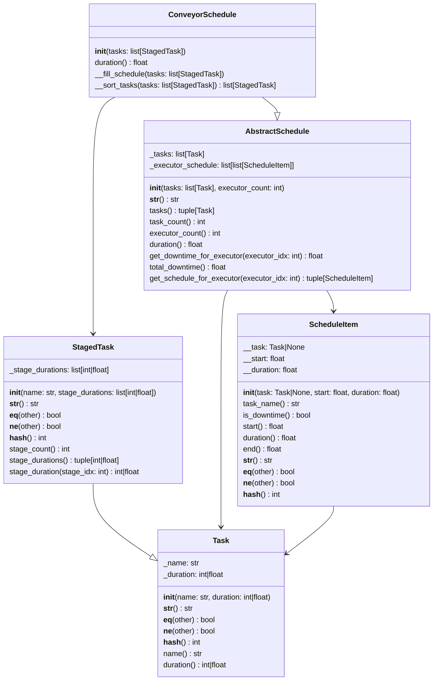

```mermaid
classDiagram

class Task {
  _name: str
  _duration: int|float
  __init__(name: str, duration: int|float)
  __str__() str
  __eq__(other) bool
  __ne__(other) bool
  __hash__() int
  name() str
  duration() int|float
}

class StagedTask {
  _stage_durations: list[int|float]
  __init__(name: str, stage_durations: list[int|float])
  __str__() str
  __eq__(other) bool
  __ne__(other) bool
  __hash__() int
  stage_count() int
  stage_durations() tuple[int|float]
  stage_duration(stage_idx: int) int|float
}

class ScheduleItem {
  __task: Task|None
  __start: float
  __duration: float
  __init__(task: Task|None, start: float, duration: float)
  task_name() str
  is_downtime() bool
  start() float
  duration() float
  end() float
  __str__() str
  __eq__(other) bool
  __ne__(other) bool
  __hash__() int
}

class AbstractSchedule {
  _tasks: list[Task]
  _executor_schedule: list[list[ScheduleItem]]
  __init__(tasks: list[Task], executor_count: int)
  __str__() str
  tasks() tuple[Task]
  task_count() int
  executor_count() int
  duration() float
  get_downtime_for_executor(executor_idx: int) float
  total_downtime() float
  get_schedule_for_executor(executor_idx: int) tuple[ScheduleItem]
}

class ConveyorSchedule {
  __init__(tasks: list[StagedTask])
  duration() float
  __fill_schedule(tasks: list[StagedTask])
  __sort_tasks(tasks: list[StagedTask]) list[StagedTask]
}

StagedTask --|> Task
ConveyorSchedule --|> AbstractSchedule

AbstractSchedule --> Task
AbstractSchedule --> ScheduleItem
ScheduleItem --> Task

ConveyorSchedule --> StagedTask
```
